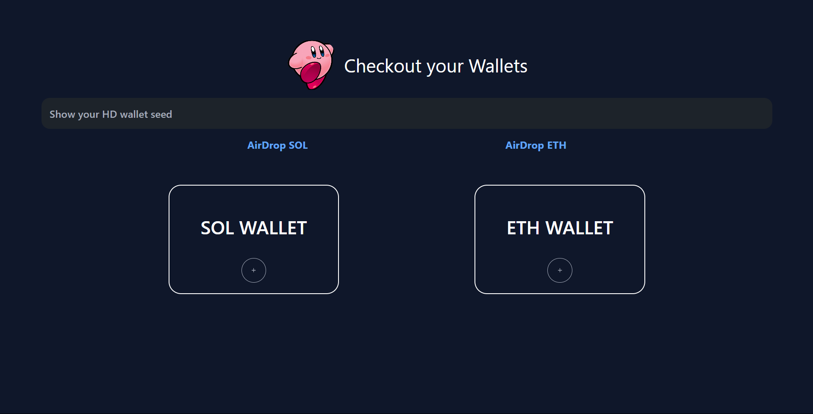

# HD-Wallet Generator
  
 This project is a React Application in TypeScript to generate HD wallets for SOL & ETH, with their pvt and public keys.
 I used DaisyUI for the components

# LiveLinks
[KirbyWallet](https://kirby-wallet.vercel.app)

# ScreenShots


## What does the application do?

- Generate random mnemonic phrases with copy functionality.
- Generate Solana wallets from a seed using a mnemonic phrase.
- Generate Ethereum wallets from a seed using a mnemonic phrase.
- Display private and public keys for the generated wallets.

## Installation

1. **Clone the repository:**

   ```bash
         git clone https://github.com/Gadzrux/KirbyWallet.git
         cd KirbyWallet 
   ```
2. **Install dependecies:**

```bash
      npm i

```
3 **Start development server:**

```bash
      npm run dev

```

## Usage
- Open the application in your browser at http://localhost:5173/.
- Click the "Generate Mnemonics" button to generate a new wallet.
- Copy it and paste is somewhere safe, once generated, the next time you open the app, you will be automatically taken to the wallets page
- Go to the wallet page
- Add accounts and click on them to see your generated SOL & ETH keys

## Further Work
- Making the site mobile responsive
